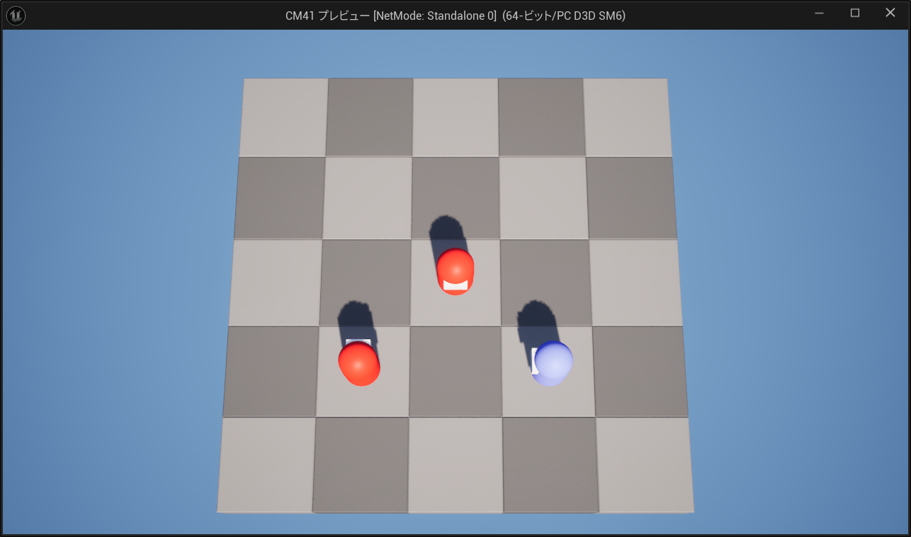

# CM41

盤面上を動き回って頭突きするだけのターン制ゲーム …の基礎実装。

基本的な Blueprint のみでどこまでいけるかチャレンジ。

## 操作方法

キーボードまたはコントローラー

- WASD / Lスティック : **移動** (+ Shift / Lトリガー : **回転**)
- Space / Aボタン : **攻撃**
- ESC / Startボタン : **終了**

## 未実装

#### ⭐️まだ敵は死なない

HitReactionState と DeathState の実装が必要。

#### ⭐️まだ敵が重なる

敵の事前行動設定時に移動不可セルの配列を作って埋めていく等が必要。

## Blueprint (Common)

### BPI_Activatable

Actor のアクティブ / 非アクティブ 切り替え用インターフェース。  
実装は Unit / PlayerUnit / EnemyUnit 参照。

### AC_ActorPool

やっつけ ObjectPool。  
BPI_Activatable とセットで使う。  
あまりテストしてないので色々足りないかもしれない。

### AC_CameraAutoFit

矩形領域にサイズをあわせるカメラ。  
あとで Actor の Follow 機能を入れたい。

### AC_Grid

2Dグリッドを管理する為のただのデータコンテナ。

### AC_StateMachine & AC_State

ステートマシンコンポーネント。  
限界が来たら StateTree に移行したいが、小規模ならこれで良いのでは ぐらいで作ったもの。  
今後必要なのは中断時（動作中の別ステート割り込み遷移）ロジック。

## Blueprint (本体)

### GM_TestGame

唯一の GameMode。  
コンポーネントとしてアタッチしてあるステートマシン (GamePhase) でゲームの進行制御を行う。

### BP_GameBoard

グリッドと Unit の紐づけを行い、グリッドへの各種操作を提供する。  
サイズ変更は DataAsset の GameSettings にて行える。  
サイズに応じてカメラは自動でサイズ調整される。

Construction Script にて Instanced StaticMesh でセルを生成しているので Editor 上で動的に確認出来る。  
(詳細タブの GridSize を変更)  

チェッカーカラーの反映は PerInstanceCustomData を使用。

### BP_Unit

グリッド上に配置可能な Pawn の基底クラス。  
Unit が実行できるアクション (移動や攻撃等) の提供がメイン。  
ステートマシンで管理している。  

### BP_UnitCommand

アクションをコマンドパターン化したもの。  
アクション自体をオブジェクト化しておくことで実行タイミングをずらしたり同時に実行させたりするのが目的。

### BP_PlayerUnit / BP_EnemyUnit

BP_Unit から派生した Pawn の実体。
現状は違うマテリアルを使っていることぐらいしか差異はない。

### BP_PlayerUnitController

PlayerUnit のコントローラ。PlayerController の派生クラス。  
入力に応じて Command を決定する。

### BP_EnemyUnitController

EnemyUnit のコントローラ。AIController の派生クラス。  
状況に応じて Command を決定する。

### BP_EnemyUnitManager

複数の EnemyUnit を管理するためのクラス。

